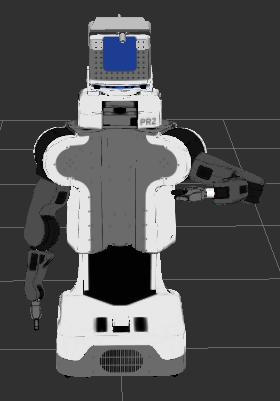
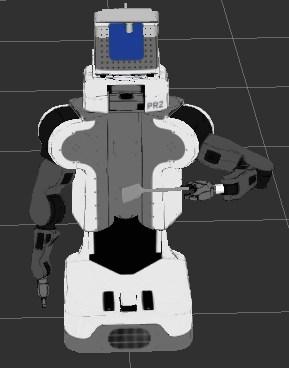

# urdf_management tutorial


## Installation

Checkout the following repos into your workspace:
  * https://github.com/ros/roslisp_common
  * https://github.com/code-iai/iai_control_pkgs
  * https://github.com/code-iai/iai_common_msgs
  * https://github.com/code-iai/designator_integration_lisp
  * https://github.com/cram-code/cram_physics
  * https://github.com/cram-code/cram_highlevel
  * https://github.com/cram-code/cram_3rdparty
  * https://github.com/cram-code/cram_core
  * https://github.com/cram-code/cram_pr2
  * https://github.com/cram-code/cram_bridge

Additional repos required only for this tutorial:
  * https://github.com/cram-code/cl_robotics_libs
  * https://github.com/PR2/pr2_robot

Note, some of these repos are still on rosbuild.

Build all the catkin packages by running ```catkin_make```


## Start-up
Start a roscore in a new terminal:
  * ```roscore```

Start controller for the joints and set the robot_description parameter to the pr2.urdf in a new terminal:
  * ```roslaunch loopback_controller_manager_examples pr2_all_controllers_simulation_dynamic_state.launch```

Start the urdf management service in a new terminal:
  * ```rosrun urdf_management urdf_management_service```

Start rviz in a new terminal:
  * ```rosrun rviz rviz```

In rviz,
  * set the fixed frame to ```base_link```
  * add a plugin of type ```DynamicRobotModel```

You should see the PR2 in rviz like you would with the normal RobotModel:




## Adding and removing a link
To add a link type in a new terminal:
  * ```rosrun urdf_management_tutorial add_spatula```

In rviz you should now be able to see a spatula in the left gripper of the PR2.




The spatula is now part of the robot description and connected to the left gripper via a fixed joint. To see the arm moving with the spatula in the gripper type:
  * ```rosrun urdf_management_tutorial move_arm```


After you added the spatula you can remove it again by typing:
  * ```rosrun urdf_management_tutorial remove_spatula```

You can also remove parts of the initial robot description. To remove the left gripper type:
 * ```rosrun urdf_management_tutorial remove_left_gripper```


Note that the parsing of the urdf will fail when you remove the gripper but still had the spatula attached.
